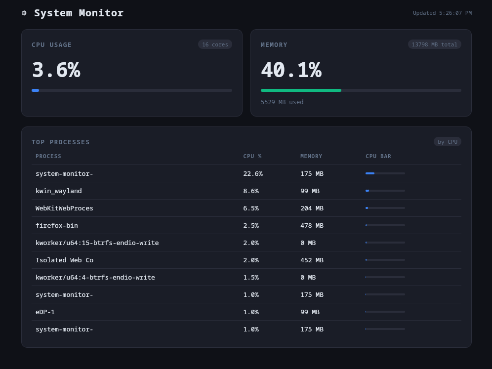

# ⚙ System Monitor Dashboard

A lightweight, native system monitoring dashboard built with **Tauri v2** and **TypeScript**. Displays real-time CPU usage, memory consumption, and top processes — packaged as a native Linux application.


> *Replace this placeholder with an actual screenshot once running*

---

## Features

- **Real-time CPU monitoring** — global usage percentage and core count
- **Memory tracking** — used/total RAM with percentage and animated progress bar
- **Top 10 processes** — sorted by CPU usage, updated every 2 seconds
- **Color-coded warnings** — bars turn amber at 70%, red at 90%
- **Tiny footprint** — ~5 MB binary vs ~150 MB for Electron equivalents
- **Native RPM/DEB packages** — installs like any system application

---

## Installation

### Download a pre-built release (easiest)

Head to the [Releases](../../releases) page and download the package for your distro:

| Format | Distro |
|--------|--------|
| `.rpm` | Fedora, Aurora, openSUSE, RHEL |
| `.deb` | Ubuntu, Debian, Linux Mint |

**Fedora / Aurora (atomic):**
```bash
sudo rpm-ostree install system-monitor-dashboard-*.x86_64.rpm
# reboot when prompted
```

**Fedora (standard):**
```bash
sudo dnf install ./system-monitor-dashboard-*.x86_64.rpm
```

**Ubuntu / Debian:**
```bash
sudo dpkg -i system-monitor-dashboard_*_amd64.deb
```

After installation the app appears in your application launcher.

---

## Build from Source

### Prerequisites

You will need the following installed:

- [Rust](https://rustup.rs/) (stable, 1.77+)
- Node.js 18+ and npm
- System libraries (see below)

**Fedora / Aurora — install all dependencies in one command:**

```bash
sudo dnf install -y \
  webkit2gtk4.1-devel \
  openssl-devel \
  curl wget file \
  libappindicator-gtk3-devel \
  librsvg2-devel \
  gcc pkg-config \
  rpm-build
sudo dnf groupinstall -y "C Development Tools and Libraries"
```

> **Aurora Linux users:** Run all build steps inside a [Fedora Toolbox](https://containertoolbx.org/) container. The host OS is immutable — the Toolbox gives you a mutable environment for compilation.
>
> ```bash
> toolbox enter   # or: toolbox create && toolbox enter
> ```

**Ubuntu / Debian:**
```bash
sudo apt update && sudo apt install -y \
  libwebkit2gtk-4.1-dev \
  libssl-dev \
  libgtk-3-dev \
  libayatana-appindicator3-dev \
  librsvg2-dev \
  build-essential \
  pkg-config \
  curl
```

---

### Clone and build

```bash
git clone https://github.com/YOURUSERNAME/system-monitor-dashboard.git
cd system-monitor-dashboard

# Install JS dependencies
npm install

# Development mode (hot reload)
npm run tauri dev

# Production build
npm run tauri build
```

Built packages will be at:
```
src-tauri/target/release/bundle/
├── rpm/   ← Fedora/RHEL installer
└── deb/   ← Debian/Ubuntu installer
```

---

## Project Structure

```
system-monitor-dashboard/
├── src/                        # Frontend (TypeScript + HTML + CSS)
│   ├── main.ts                 # invoke() calls to Rust backend
│   ├── index.html              # Dashboard layout
│   └── styles.css              # Dark theme, progress bars, table
│
└── src-tauri/                  # Rust backend (native OS layer)
    ├── src/
    │   ├── lib.rs              # Tauri commands: get_cpu_info, get_memory_info, get_top_processes
    │   └── main.rs             # App entry point
    ├── Cargo.toml              # Rust dependencies (sysinfo, serde)
    └── tauri.conf.json         # App config, window size, bundle targets
```

### How it works

Tauri runs two processes that communicate via a typed bridge:

```
Frontend (WebView / TypeScript)          Backend (Rust / OS)
                                
  invoke("get_cpu_info")       ──────►   #[tauri::command]
                                         fn get_cpu_info(state) -> CpuInfo
  CpuInfo { usage, cores }     ◄──────   
```

- The JS frontend calls Rust functions by name using `invoke()`
- Rust functions marked `#[tauri::command]` are exposed to JS
- Return types are serialized to JSON automatically via `serde`
- A shared `sysinfo::System` instance is kept alive in `State<AppState>` to avoid expensive re-initialization on every call

---

## Tech Stack

| Layer | Technology |
|-------|-----------|
| Frontend | TypeScript, HTML, CSS (Vanilla — no framework) |
| Backend | Rust |
| Tauri | v2 |
| System metrics | [`sysinfo`](https://crates.io/crates/sysinfo) crate |
| Serialization | [`serde`](https://crates.io/crates/serde) |
| Bundler | Vite |

---

## Contributing

Contributions are welcome! Here are some ideas for extension:

- [ ] CPU usage history graph (canvas / Chart.js)
- [ ] Per-core CPU breakdown
- [ ] Disk I/O monitoring
- [ ] Network traffic monitoring
- [ ] System tray with live CPU % indicator
- [ ] Configurable refresh rate
- [ ] Alert notifications when thresholds are crossed

To contribute:

```bash
# Fork the repo, then:
git checkout -b feat/your-feature
# make your changes
git commit -m "feat: describe your change"
git push origin feat/your-feature
# open a Pull Request
```

---

## License

MIT — see [LICENSE](LICENSE) for details.
